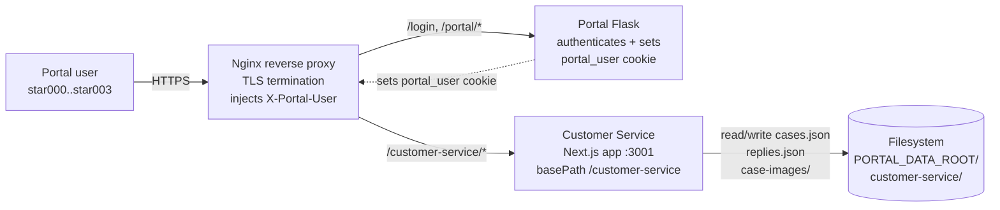
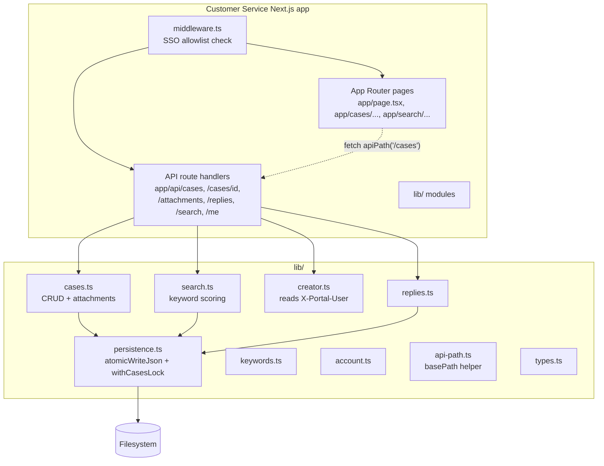
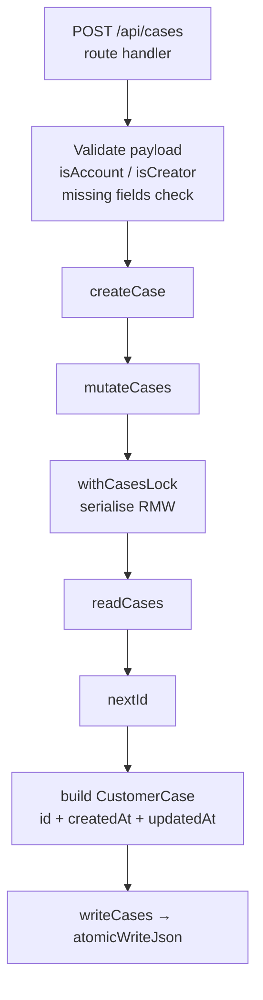
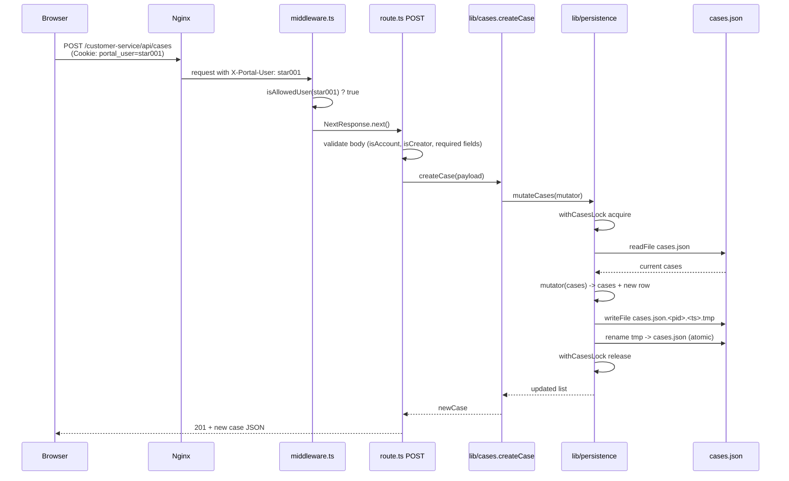
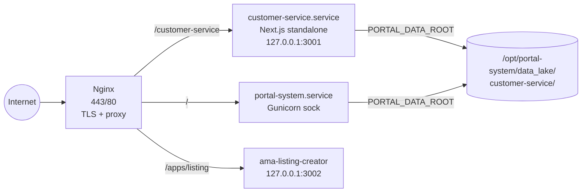

# Customer Service — Architecture

Last updated: 2026-04-17

This doc uses C4 levels. Read top-to-bottom; stop at the level that answers your question.

## Level 1 — System Context



**Responsibilities:**
- Portal Flask owns login + session cookie. CS never sees a password.
- Nginx reads the `portal_user` cookie and forwards it as the `X-Portal-User` request header to CS.
- CS trusts the header, enforces an allowlist, persists cases to JSON + images to disk.

## Level 2 — Container



**Module boundaries (from `lib/`):**

| Module | Responsibility |
|--------|----------------|
| `persistence.ts` | Resolve `PORTAL_DATA_ROOT`, provide `readCases` / `writeCases` / `mutateCases` / `readReplies`, atomic-write helper, in-process mutex. |
| `cases.ts` | CRUD for cases; attachment storage; `getSalesRecordNo` read-compat shim. |
| `search.ts` | Deterministic scoring (see `design.md`). |
| `keywords.ts` | Utility for keyword deduping / normalisation. |
| `account.ts`, `creator.ts` | Enum guards + the `getCurrentCreator(request)` helper that reads `X-Portal-User`. |
| `replies.ts` | Thin wrapper over `readReplies`. |
| `api-path.ts` | Prefixes `/customer-service` to every `fetch` URL. Page links use `next/link` which handles basePath natively, but raw fetch / `` must use `apiPath` / `appPath`. |
| `types.ts` | All DTOs — `Account`, `Creator`, `Message`, `Attachment`, `CustomerInfo`, `CustomerCase`, `StandardReply`, `CasePatch`, `SearchResult`. |

## Level 3 — Component (inside `lib/cases.ts`)



**Invariant:** every path that writes `cases.json` goes through `mutateCases`, which acquires `withCasesLock` and calls `atomicWriteJson`. This is the ONE rule that guarantees no lost updates + no half-written files.

## Sequence — `POST /api/cases` request



Unauthorised variant: if `X-Portal-User` is missing or not in the allowlist, `middleware.ts` short-circuits with `401 JSON` for `/api/*` and `302 → /login?next=...` for page routes — request never reaches the API handler.

## Data Model

Source of truth: `lib/types.ts`.

```ts
type Account = 'gorble' | 'ssys' | 'ama_tktk'
type Creator = 'star001' | 'star002' | 'star003'

interface Message {
  role: 'customer' | 'agent'
  text: string
  ts: string               // ISO 8601
}

interface Attachment {
  id: string               // 'att-001' per case
  filename: string         // sanitized on-disk name, e.g. 'att-001.png'
  originalName: string     // sanitized client-provided name
  mime: string             // image/jpeg | image/png | image/webp | image/gif
  size: number             // bytes
  createdAt: string        // ISO 8601
}

interface CustomerInfo {
  name: string
  address1: string
  postcode: string
  email: string
  salesRecordNo: string    // preferred
  orderId?: string         // legacy fallback
}

interface CustomerCase {
  id: string               // 'case-001'
  customer: CustomerInfo
  account?: Account        // optional on legacy rows
  creator?: Creator        // optional on legacy rows
  standardSku: string
  conversation: Message[]
  category: string
  keywords: string[]
  issue: string
  resolution: string
  status: 'open' | 'resolved'
  attachments?: Attachment[]
  createdAt: string
  updatedAt: string
}

interface StandardReply {
  id: string               // 'reply-001'
  category: string
  keywords: string[]
  question: string
  reply: string
}
```

**On-disk layout:**

```
PORTAL_DATA_ROOT/
└── customer-service/
    ├── cases.json          # CustomerCase[]
    ├── replies.json        # StandardReply[] (seeded on first read)
    └── case-images/
        └── <caseId>/
            └── <attId>.<ext>
```

## Deployment topology



- **Process model:** one `next start` process bound to `127.0.0.1:3001`, managed by `customer-service.service` systemd unit. Single process is load-bearing — the in-process mutex in `persistence.ts` only works because there's exactly one Node process.
- **basePath:** `/customer-service` set in `next.config.ts`. Nginx `location /customer-service/ { proxy_pass http://127.0.0.1:3001; }` keeps the path intact.
- **Data root:** `PORTAL_DATA_ROOT=/opt/portal-system/data_lake` (same env the Python portal uses). CS namespaces its files under the `customer-service/` subdir so other services don't collide.
- **SSO:** nginx sets `proxy_set_header X-Portal-User $cookie_portal_user;` before forwarding to port 3001. Middleware verifies against a hard-coded allowlist.
- **Deploy pipeline:** `.github/workflows/deploy.yml` on the `customer-service` submodule SSHes to VPS, `git pull`, `npm ci`, `npm run build`, `systemctl restart customer-service`.
