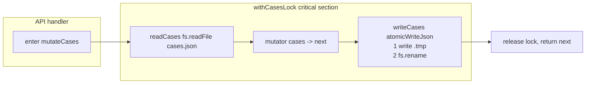

# Customer Service — Design

Last updated: 2026-04-17

## API Schema

All routes are mounted under the Next.js `basePath` `/customer-service`. From the browser, the full URL is `/customer-service/api/...`. From code, use `apiPath('/cases')` — the `lib/api-path.ts` helper prepends the basePath.

### `GET /api/cases`

List cases with optional filters.

Query params: `status` (`open` | `resolved`), `sku`, `account`, `q` (free-text).

Response `200`:
```json
[
  {
    "id": "case-001",
    "customer": {
      "name": "Jane Doe",
      "address1": "12 High St",
      "postcode": "SW1A 1AA",
      "email": "jane@example.com",
      "salesRecordNo": "17-12345-67890"
    },
    "account": "ssys",
    "creator": "star002",
    "standardSku": "R140_Black_225",
    "conversation": [
      { "role": "customer", "text": "arrived with a scratch", "ts": "2026-04-15T10:20:00Z" }
    ],
    "category": "Product Issue",
    "keywords": ["scratch", "lens"],
    "issue": "Visible scratch on left lens on delivery",
    "resolution": "",
    "status": "open",
    "attachments": [],
    "createdAt": "2026-04-15T10:21:03Z",
    "updatedAt": "2026-04-15T10:21:03Z"
  }
]
```

### `POST /api/cases`

Create a case. The server assigns `id`, `createdAt`, `updatedAt`, and initialises `attachments` to `[]`.

Request:
```json
{
  "customer": { "name": "Jane Doe", "address1": "12 High St", "postcode": "SW1A 1AA", "email": "jane@example.com", "salesRecordNo": "17-12345-67890" },
  "account": "ssys",
  "creator": "star002",
  "standardSku": "R140_Black_225",
  "conversation": [{ "role": "customer", "text": "arrived scratched", "ts": "2026-04-15T10:20:00Z" }],
  "category": "Product Issue",
  "keywords": ["scratch", "lens"],
  "issue": "Scratch on left lens",
  "resolution": "",
  "status": "open"
}
```

Response `201` = full `CustomerCase` including server-assigned fields. Errors: `400` (missing / invalid fields), `500`.

### `GET /api/cases/[id]`

Response `200` = `CustomerCase`. `404` if not found.

### `PATCH /api/cases/[id]`

Partial update. Only `status | resolution | keywords | issue | category | conversation | account | creator` are patchable (see `CasePatch` in `types.ts`). Other fields are immutable via this route.

Request:
```json
{ "status": "resolved", "resolution": "Replacement shipped, tracking GB123" }
```

Response `200` = updated `CustomerCase`. `404` if not found.

### `DELETE /api/cases/[id]`

Deletes the case and wipes its `case-images/<id>/` directory (best-effort).

Response `204` on success. `404` if not found.

### `POST /api/cases/[id]/attachments`

`multipart/form-data` with a single `file` field.

Constraints enforced server-side:
- MIME allowlist: `image/jpeg`, `image/jpg`, `image/png`, `image/webp`, `image/gif`.
- Size: 5 MB (`5 * 1024 * 1024` bytes).

Response `201`:
```json
{
  "id": "att-001",
  "filename": "att-001.png",
  "originalName": "scratch_evidence.png",
  "mime": "image/png",
  "size": 184392,
  "createdAt": "2026-04-15T10:22:11Z"
}
```

Errors: `400` (missing `file`), `404` (case), `413` (too large), `415` (unsupported MIME), `500`.

### `GET /api/cases/[id]/attachments/[attId]`

Streams the file bytes with `Content-Type: <mime>`, `Content-Disposition: inline`, `Cache-Control: private, max-age=0, must-revalidate`. `404` if either id or attId misses.

### `DELETE /api/cases/[id]/attachments/[attId]`

Removes disk file + metadata row. `204` on success, `404` otherwise.

### `GET /api/replies`

Returns the full `StandardReply[]`. On first-ever read, `persistence.ts` seeds the file with 10 canned replies (see `SEED_REPLIES` in `persistence.ts`).

### `POST /api/search`

Request:
```json
{ "query": "lens scratched", "skuHint": "R140_Black_225", "accountHint": "ssys" }
```

Response `200` = top-5 `SearchResult[]`. Empty array if `query` is blank.

`SearchResult` shape:
```ts
{ type: 'case' | 'reply', score: number, case?: CustomerCase, reply?: StandardReply }
```

### `GET /api/me`

Returns the currently-resolved creator from the `X-Portal-User` header (mapped via `getCurrentCreator`). Used by the UI to preselect the creator dropdown.

Response:
```json
{ "creator": "star002" }
```

## 错误码 / HTTP status codes

| Status | When |
|--------|------|
| `200` | Successful GET / POST-returning-body / PATCH. |
| `201` | Resource created — `POST /cases`, `POST /cases/:id/attachments`. |
| `204` | Successful DELETE (no body). |
| `400` | Missing required fields (e.g. `customer.name`) or invalid enum (`account`, `creator`); missing `file` on multipart upload. |
| `401` | Middleware: `X-Portal-User` missing or not in allowlist. Body: `{ error: 'unauthenticated', login_url: '/login' }`. |
| `404` | Case id or attachment id not found. |
| `413` | Attachment exceeds 5 MB. |
| `415` | Attachment MIME not in the image allowlist. |
| `500` | Uncaught exception. Body: `{ error: <message> }`. |

## 认证 / Authentication

Passive SSO. There is no session store, no password, no JWT inside CS.

1. User logs into the portal Flask at `/login`. Portal sets a `portal_user` cookie scoped to the apex domain.
2. Nginx forwards cookie value as a request header:
   ```nginx
   proxy_set_header X-Portal-User $cookie_portal_user;
   ```
3. `middleware.ts` reads `x-portal-user`, checks against the hard-coded allowlist `['star000', 'star001', 'star002', 'star003']`.
   - API routes (`/api/*`) → `401` JSON on miss.
   - Page routes → `302 /login?next=<original>` on miss.
4. Static assets (`/_next/*`, favicons, images) bypass the check.
5. Local dev: set `NEXT_PUBLIC_DEV_BYPASS_AUTH=true` in `.env.local` to skip.

`lib/creator.ts` `getCurrentCreator(request)` maps the allowlist usernames to the `Creator` type exposed to the UI.

## 输入校验上限 / Input validation caps

| Field / request | Cap today | Enforced by |
|-----------------|-----------|-------------|
| Attachment size | 5 MB | `app/api/cases/[id]/attachments/route.ts` |
| Attachment MIME | jpg / jpeg / png / webp / gif | same handler |
| Attachment filename | sanitised to `[\w.\-]` | `lib/cases.ts#sanitizeFilename` |
| `account` enum | `gorble` / `ssys` / `ama_tktk` | `isAccount` guard in `POST /cases` |
| `creator` enum | `star001` / `star002` / `star003` | `isCreator` guard |
| Required create fields | `customer.name`, `customer.salesRecordNo`, `account`, `creator`, `standardSku`, `issue`, `conversation.length > 0` | explicit list in `POST /cases` |

**Future caps to add** (not yet enforced):
- Max conversation messages per case (no cap today → unbounded JSON growth possible).
- JSON request body size (Next.js default applies; no explicit ceiling).
- Max attachments per case (no cap today).
- Max total cases.json size — at some threshold switch to SQLite (see ADR-001).

## 性能预算 / Performance budget

Targets, not SLAs. Measured from inside VPS with warm cache.

| Endpoint | p50 | p95 |
|----------|-----|-----|
| `GET /api/cases` (no filter, ≤500 rows) | 15 ms | 80 ms |
| `GET /api/cases` with `q` filter | 20 ms | 120 ms |
| `GET /api/cases/[id]` | 10 ms | 50 ms |
| `POST /api/cases` (single writer) | 25 ms | 150 ms |
| `PATCH /api/cases/[id]` | 30 ms | 180 ms |
| `POST /api/cases/[id]/attachments` (1 MB file) | 60 ms | 300 ms |
| `GET /api/cases/[id]/attachments/[attId]` (stream) | 20 ms | 100 ms |
| `POST /api/search` (≤500 cases) | 25 ms | 150 ms |
| `GET /api/replies` | 5 ms | 30 ms |

Budget busters to watch for: `cases.json > 1 MB` (parse cost climbs), >100 concurrent writes (mutex queue), attachments stored in a network FS instead of local disk.

## 数据流图 / Data flow through the lock



Every write path — `createCase`, `patchCase`, `deleteCase`, `addAttachment`, `removeAttachment` — goes through this exact critical section. Reads (`getAllCases`, `getCaseById`, search) skip the lock since JSON parsing is synchronous in Node and a reader can't observe a half-written file thanks to the `.tmp` + rename pattern.

## 数据持久化 / Persistence

- **Serialisation format:** JSON. `cases.json` is `CustomerCase[]`; `replies.json` is `StandardReply[]`.
- **Atomic write:** `atomicWriteJson(file, data)` writes to `<file>.<pid>.<ts>.tmp`, then `fs.rename` to the target path. `rename` is atomic on POSIX and on Windows (same filesystem) so readers either see the old file or the new file, never a torn file.
- **In-process mutex:** `withCasesLock(fn)` chains onto `casesLockPromise`. Each call awaits the previous promise before running its critical section, guaranteeing serial RMW even when multiple async handlers interleave.
- **Images:** binary files under `<dataRoot>/customer-service/case-images/<caseId>/<attId>.<ext>`. Never stored inline in JSON (see ADR-007).
- **Why not SQLite?** See ADR-001. Short version: ≤1 k cases expected for years; JSON is trivially diff-able, backup-able by `cp`, greppable from the CLI, and the entire CS data directory is cheap to `rsync` into the nightly VPS backup.

## 技术选型 / Tech choices

| Concern | Choice | Reason |
|---------|--------|--------|
| Framework | Next.js 16.2 (App Router) | Shared stack with `ama-listing-creator`; single standalone `next start` process; file-system routing for API keeps handlers small. Note — 16.2 has breaking changes vs older Next — `AGENTS.md` warns to consult `node_modules/next/dist/docs/` before structural changes. |
| Runtime | React 19.2 | Matches Next 16.2. |
| Language | TypeScript (strict) | Catches `account` / `creator` enum drift; `CasePatch` ensures PATCH can't touch immutable fields. |
| Database | None — JSON on disk | See ADR-001. |
| Auth lib | None — passive `X-Portal-User` header | See ADR-002. |
| Lockfile lib | None — in-process mutex | See ADR-003. Single Node process. |
| Styling | Tailwind v4 | Matches `ama-listing-creator`. |
| File parsing | `xlsx` (only used in list-export features, not API-critical) | Single dependency carries the export feature. |
| Testing | None in-tree today | Manual smoke testing via portal UI; any refactor of `persistence.ts` or `search.ts` should add unit tests before merging. |
